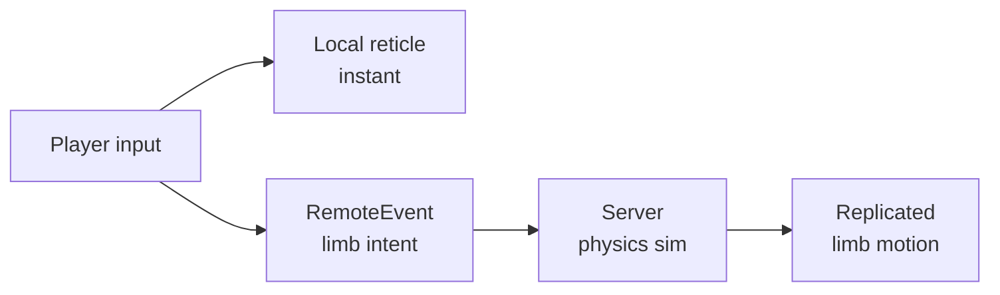
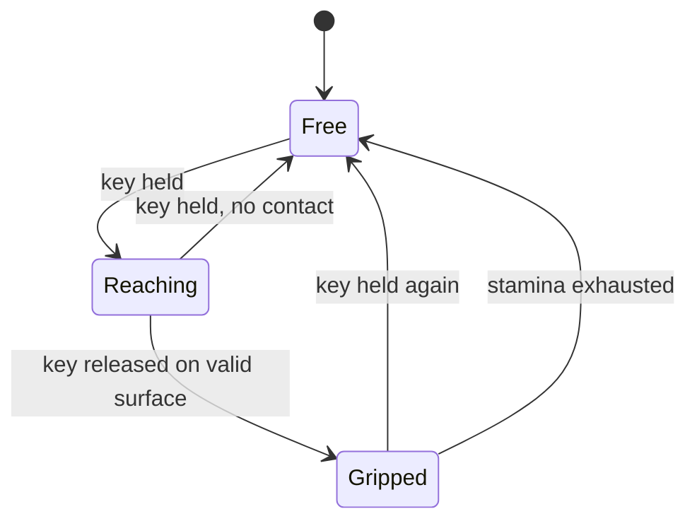
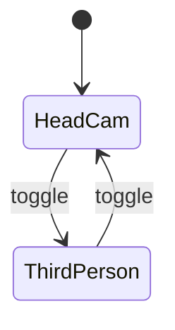
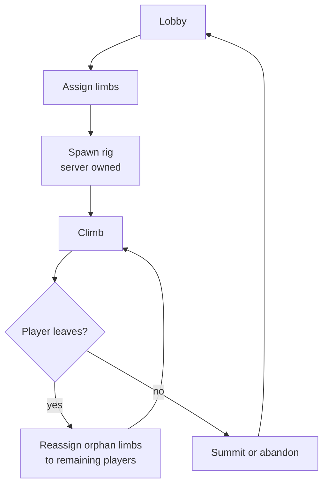

# Co-op Limb Climber — Technical Design Document

2026-09-21 · @Someone

A 1–4 player climbing obby where players share one ragdoll body and each control individual limbs. Physics-driven, server-authoritative, first person. This document is the build spec: every architectural decision is made here so the coding phase never has to reverse one.

## Concept and locked decisions

Players share one ragdoll climber and each control individual limbs, moving one deliberately at a time up a mountain. The comedy and tension come from physics, not puzzle logic.

These are settled. The coding phase treats them as fixed inputs, not open questions.

| # | Decision | Ruling | Why it is locked |
| --- | --- | --- | --- |
| 1 | Mid-run joining | Not allowed. Limbs assigned at run start, session locked | Retrofitting mid-run assignment later means rewriting the ownership and camera handoff |
| 2 | Tools | Consumable. Each use spends the item | Makes every tool a real decision and feeds the checkpoint economy |
| 3 | Fall handling | No global reset. Last player-placed anchor is the fallback | Keeps tension; ties failure directly to the tool economy |
| 4 | Limb self-collision | On, between limbs and torso. Off between the two parts of the same limb | Limbs passing through the body kills the physicality; same-limb collision causes joint jitter |
| 5 | Coordination | HUD communicates limb intent visually. Voice is a bonus, never assumed | A game that only works with voice chat loses most of its players |
| 6 | Physics model | Physics-driven, not snap-to-hold | Snapping turns this into a turn-based puzzle game and deletes the genre's appeal |
| 7 | Authority | Server-owned physics body | The only model that treats all players equally — see next section |

Decision 6 reverses an earlier suggestion of anchor-point stepping. It is the easier build, but it is not this game.

**The one-sentence design test.** Every feature added later should make the body harder to control in an interesting way, not easier to control in a convenient way.

## Core architecture

One engine rule decides the whole shape of this project: **a Roblox physics assembly has exactly one network owner.** Four clients cannot each simulate one limb of the same body. This is not a limitation to engineer around.

### Why the server owns the body

| Model | Input lag | Verdict |
| --- | --- | --- |
| One client owns the assembly | Owner 0ms, everyone else 50–150ms | Rejected — unfair, and the advantage shifts depending on who joined first |
| Server owns the assembly | All players equal, roughly 60–120ms | Chosen — consistent, exploit-resistant, one code path for 1, 2 and 4 players |

For a slow, deliberate climbing game the lag is acceptable and arguably helps the body feel heavy. Call `BasePart:SetNetworkOwner(nil)` on every rig part at spawn.

### The latency trick

The limb lags, but the **aim does not**. Each client resolves its own aim point locally and instantly; only the limb's pursuit of it goes through the server. Players read responsiveness from the aim, so the controls feel tight even though the body is behind.

Since the phase 4 revision the aim comes off the camera, and how depends on the view mode: down the centre of a locked view in first person, through a free cursor in third. Both resolve locally and immediately. See the camera section.



### No Humanoid, no player characters

Set `Players.CharacterAutoLoads = false`. Players get a camera and an input stream, nothing else. The climber is a single server-owned Model with **no Humanoid instance**.

This is not a small optimisation. A Humanoid runs a state machine that actively fights a ragdoll — it applies standing forces, plays animations, and reasserts itself after you disable it. Most guidance online is about suppressing that behaviour. Never creating it is cleaner, and it also removes default movement, respawn handling and character replication from the problem entirely.

**Consequence to plan for:** no Humanoid means no built-in health, no default camera subject and no character-based respawn. All three are replaced deliberately in later sections.

## The climber rig

Fourteen parts: a torso, a head, and four three-segment limbs, which is the minimum that bends convincingly.

| Part | Parent joint | Joint type | Angle limit | Notes |
| --- | --- | --- | --- | --- |
| Torso | — | root part | — | Heaviest part; the assembly root |
| Head | Torso | BallSocket | 45° | Camera anchor, not a hitbox |
| UpperArm L/R | Torso | BallSocket | 90° | Shoulder |
| LowerArm L/R | UpperArm | HingeConstraint | 0–145° | Elbow — hinge, not ball socket |
| Hand L/R | LowerArm | BallSocket | 60° | Grip point, carries the AlignPosition |
| UpperLeg L/R | Torso | BallSocket | 75° | Hip |
| LowerLeg L/R | UpperLeg | HingeConstraint | 0–140° | Knee — hinge |
| Foot L/R | LowerLeg | BallSocket | 45° | Grip point |

**Elbows and knees are hinges, not ball sockets.** A ball socket with tight limits will still let a knee bend sideways under load, which looks broken and is hard to diagnose later. Use `HingeConstraint` with `LimitsEnabled` and the real anatomical range.

### Mass properties

Set `CustomPhysicalProperties` explicitly on every part. Roblox defaults will feel wrong, and the wrongness reads as a constraint bug rather than a density problem — this wastes days if left to chance.

Starting ratios, relative to torso = 1.0:

| Segment | Relative density |
| --- | --- |
| Torso | 1.0 |
| Head | 0.4 |
| Upper limb | 0.5 |
| Lower limb | 0.35 |
| Extremity | 0.2 |

A heavy torso and light extremities means limbs whip around a stable core, which is what you want. Inverting this gives a floppy, uncontrollable body.

**Friction:** high on extremities (0.8–1.0), low on torso and upper limbs (0.2–0.3). The body should slide off surfaces while hands and feet bite.

## Limb movement and grip

### Movement without an IK solver

Do not write an inverse-kinematics solver. Let physics solve the arm shape:

1. Each extremity carries an `AlignPosition` in `OneAttachment` mode
2. Its target is a world-space point derived from that player's camera ray
3. The joint limits above constrain what poses are reachable
4. The arm shape falls out of the simulation for free

This handles obstacles, awkward angles and collisions automatically. It is the single largest complexity saving in the whole design.

`AlignPosition.MaxForce` is the **primary feel dial** for the entire game. Too high reads as robotic, too low as a limp noodle. Expect to spend real time tuning it, and expose it in the shared config from day one.

### The grip state machine



Control loop per limb: **hold the key to release and aim, release the key to grip.** Holding is the active, tiring state. This inversion matters — it means letting go of the keyboard leaves you safely gripped rather than falling.

**A grip creates a `BallSocketConstraint`** between the extremity and the surface, never a `WeldConstraint`. A ball socket lets the body pivot around the grip point, which is physically correct and looks dramatically better when the climber is dangling from one hand.

### One function governs everything

```lua
CanGrip(limb, surfacePart, equippedTools) --> (success: boolean, strength: number)
```

Every surface type, every tool, every future upgrade is a modifier passed into this function — never a special case bolted onto movement code. **This is the main thing standing between you and an unmaintainable codebase in three months.**

### Grip stamina

Each limb has stamina that drains while bearing load and regenerates while resting. Drain scales with how few limbs are gripped:

| Limbs gripped | Drain rate | Feel |
| --- | --- | --- |
| 1 | Very fast | Seconds before failure — emergency only |
| 2 | Fast | Sustainable briefly; the normal climbing state |
| 3 | Slow | Stable, the resting position |
| 4 | Regenerating | Safe recovery |

This creates pacing, tension and a reason to plan routes — all from one number. It is also what makes the three-points-of-contact climbing rule emerge naturally rather than being taught.

## Surfaces and tools

### Surfaces via CollectionService tags

Tag parts in Studio; a config table maps tag to behaviour. Building the map becomes tagging, with no code changes to add a surface.

| Tag | Base grip | Unlocked by | Behaviour |
| --- | --- | --- | --- |
| `Rock` | 1.0 | — | The default climbable surface |
| `Ice` | 0.0 | Ice screw | Ungrippable bare-handed |
| `Metal` | 0.6 | Climbing gloves | Slippery but possible |
| `Crumbling` | 1.0 | — | Grips normally, then fails after 3–5 seconds |
| `Ungrippable` | 0.0 | nothing | Hard boundary; scenery and walls |

Implement the full tag system in phase 1 even though only `Rock` is needed. Adding it later means revisiting every grip call site.

### Two tool families

These look similar in a design doc and behave nothing alike in code. **Conflating them causes a rewrite.** All tools are consumable per decision 2.

**Grip modifiers** — pure inputs to `CanGrip`, no world state, trivial to add.

| Tool | Effect | Uses |
| --- | --- | --- |
| Ice screw | Unlocks `Ice` for one grip | 1 |
| Climbing gloves | Grip strength ×1.5 | 5 grips |
| Chalk | Stamina regen ×2 for 30s | 1 |

**World anchors** — spawn real instances with their own lifecycle, ownership and cleanup.

| Tool | Effect | Uses |
| --- | --- | --- |
| Piton | Drives a permanent new hold into any surface | 1 |
| Rope | `RopeConstraint` from torso to a fixed point | 1 |
| Grappling hook | Flings one extremity to a distant point | 1 |

World anchors are also the checkpoint system — see the next section. Every anchor is therefore a genuine decision: spend it as a safety net now, or save it and risk the fall.

**Inventory is shared, not per-player.** One pool for the whole team. In 4-player mode this forces an argument about who gets the last piton, which is exactly the kind of friction the game wants.

## Camera system

**Revised 2026-09-22, after the phase 4 playtest.** The original design gave the player no control of the view: the camera took its orientation from the climber's head, heavily damped, and a focus camera existed to compensate by swinging to frame whichever limb was being moved. Played, it was unusable — not hard in the intended way, just blind. Mouse-look replaces it and the focus camera is gone. The sections below are the revision; the reasoning that survived it is kept because it is still load-bearing.

### Head-cam must be stabilised

A camera rigidly parented to a ragdoll head is a motion-sickness generator. Instead:

- Follow the head's **position** with light damping
- Take **rotation from the mouse**, not from the head. The head's orientation is read nowhere. Which mouse movements count is the view mode's business, not this rule's — see below
- **Hard-lock the up vector to world-up.** The view never rolls, ever

The body flails; the horizon does not. That rule is the difference between an immersive game and one people quit after two minutes, and it is unchanged.

What changed is the second bullet. Damping the head's orientation was the original answer to the same problem, and it does keep the horizon steady — but it also means the player cannot choose where to look, which no amount of tuning fixes. Mouse-look solves the motion problem the same way (the view only moves when the player moves it) while handing back control. The camera is not damped toward the mouse: rotation is 1:1 and immediate, because a view that lagged the hand moving it reads as broken rather than as heavy.

### Mouse-look and aiming

The two view modes take their input differently, and therefore aim differently. This is deliberate: each mode uses the cursor convention players already expect from it.

| | Cursor | Turning the view | Pivot | Aim ray | Reticle |
| --- | --- | --- | --- | --- | --- |
| **First person** | Locked to centre, hidden | Any mouse movement | Head | Camera's look direction | Dot fixed at centre |
| **Third person** | Free and visible | Right button held and dragged | Torso, raised to chest height | Through the cursor | The cursor itself; dot hidden |

First person is the intended experience and is the stricter of the two: the player aims by turning, and the reticle never moves within the viewport. Third person is Roblox's own camera, because a player who has reached for the third-person toggle has reached for the familiar thing and should get it — free cursor, right-drag to look, point at what you want. During a drag the cursor is pinned where it was pressed, as Roblox's camera does, so it cannot run off the edge mid-rotation.

**The two modes pivot around different parts**, which is not an inconsistency but the point. First person sits at the head because that is where eyes go. Third person orbits the torso, raised a little toward the chest: the head is the top of the body, so pivoting on it puts the orbit centre above everything the player needs to see and rides the whole frame high. Third person is a true orbit — the camera sits back along its own look direction from the pivot and always looks straight at it, so pitching swings the camera around the body rather than sliding it up the frame.

Third person aiming through the cursor is not a concession, it is the better fit: pulled back from the body, the player can see several holds at once and point at one without swinging the whole view to face it.

The latency trick holds in both. Each resolves locally and instantly; only the limb's pursuit of the target goes through the server. What carries the sense of responsiveness differs — the whole moving view in first person, the cursor in third — but neither waits on the network.

### There is no focus camera

Removed. It existed because the player could not look where they wanted, and with mouse-look they can — the player simply looks at the limb.



**This costs something real, and it has to be paid back elsewhere.** The focus blend was named as a free non-verbal signal to other players that someone was about to move, supporting decision 5. That claim was already weak — each client runs its own camera, so the blend was only ever visible to the player performing it — but removing it means decision 5 now rests entirely on the HUD's limb-intent indicator, which does not exist yet.

Decision 5 is locked, so that indicator is no longer optional polish: it is the only thing carrying the decision. `LimbState` already broadcasts `Reaching` to every client, so the data is there and only a reader is missing. **It must ship in phase 5.**

### Third-person toggle is mandatory

First person is the intended experience. Ship the toggle anyway. With a control scheme this novel, forcing a camera mode will lose players who would otherwise have stayed. Make it a setting, not a debate.

### Per-player independence

Each client runs its own `CameraController`. In 4-player mode every screen looks different and shows a different part of the climb. That asymmetric information is a feature — it means players genuinely have to describe what they can see.

## Session flow

### Limb assignment

One server module, `LimbAssignment`, is the single source of truth. Every other system asks it who owns a limb; nothing else stores that mapping.

There is no lobby anywhere in the build order, so assignment cannot be negotiated. The layout is fixed and derived from join order alone.

| Players | Player 1 | Player 2 | Player 3 | Player 4 |
| --- | --- | --- | --- | --- |
| 1 | all four | — | — | — |
| 2 | ArmR + LegR | ArmL + LegL | — | — |
| 3 | ArmR + LegR | ArmL | LegL | — |
| 4 | ArmR | ArmL | LegR | LegL |

Two properties make this readable rather than arbitrary: player 1 holds `ArmR` in every layout, and arms are handed out before legs. A player's first limb therefore does not move as the headcount changes.

**Keys.** `Q` / `E` / `Z` / `C` map to `ArmR` / `ArmL` / `LegR` / `LegL` and never rebind — the two-player split is exactly "Q + Z, then E + C" because Q/Z are the right side and E/C the left. A player who owns exactly one limb may additionally press `Space` for it, which is what the four-player row of the original key table meant.

**Run start.** With no lobby there has to be a defined moment when the session locks. The run starts `Config.Session.LobbyGraceSeconds` after the first player joins: everyone present at that instant is assigned, and the session locks per decision 1. Anyone arriving later is a spectator — camera and reticle, no limbs. If more than four players are present, the first four by join order are assigned and the rest spectate.

### Run lifecycle

Runs are locked once started, per decision 1.



**Disconnects still need handling even with joining locked.** Orphaned limbs reassign to whoever remains rather than freezing or erroring. A 4-player run that loses someone becomes a harder 3-player run, which is a better outcome than a dead session.

The reassignment rule: each orphaned limb goes to the remaining player holding the fewest limbs, ties broken by join order. **Limbs already held do not move.** The result is therefore not the same as the table above for that headcount, and that is deliberate — taking a limb out of someone's hands mid-climb is worse than an uneven split.

**An orphaned limb may be mid-reach.** If the departing player disconnected while holding the key, the last intent the server saw was `isHeld = true`, leaving the limb in `Reaching` with its `AlignPosition` enabled and pulling at a target no release will ever clear. Reassignment drops such a limb to `Free` and disables the align. It does not attempt a grip: a disconnect must not hand out a free hold.

**When the last participant leaves, the session unlocks** and the next player to join opens a fresh grace window. This is not mid-run joining — there is no run left to join — and without it a server whose players have all left stays dead until it restarts.

### Failure and progress

No traditional checkpoints — they undercut the tension the genre runs on. **Player-placed anchors are the checkpoint system.** The last driven piton or fixed rope is the fallback point.

This ties failure directly into the consumable tool economy and creates a real decision at every anchor: spend it here, or push on and risk losing everything since the last one. That is meaningful tension generated entirely by systems already being built for other reasons.

**Falling** applies no damage — there is no Humanoid and no health. The consequence is lost progress and lost time, which is sufficient. A fall past the last anchor respawns the rig at that anchor with stamina restored.

## Module structure

Hand this layout to whoever writes the code so they do not invent their own. Directories match Roblox service locations.

**ServerScriptService/Climber/**

| Module | Responsibility |
| --- | --- |
| `ClimberRig` | Builds the rig, sets network ownership, owns the physics body |
| `GripService` | Grip and release, constraint creation, stamina tracking |
| `LimbAssignment` | Player to limb mapping; single source of truth |
| `ToolService` | Pickups, shared inventory, anchor placement and cleanup |
| `AnchorService` | Checkpoint anchors, fall detection, rig respawn |
| `SurfaceConfig` | Tag to grip-properties table |

**StarterPlayerScripts/Climber/**

| Module | Responsibility |
| --- | --- |
| `InputRouter` | Keys to limb intents, for this player's limbs only |
| `TargetReticle` | Local, instant, predicted aim point |
| `CameraController` | Stabilised mouse-look head-cam, third-person toggle |
| `HUD` | Stamina bars, shared inventory, limb ownership indicators |

**ReplicatedStorage/Climber/**

| Module | Responsibility |
| --- | --- |
| `Config` | Every tunable in one place — masses, forces, stamina rates, blend times |
| `Net` | RemoteEvent definitions and payload shapes |
| `Types` | Shared type definitions if using Luau strict mode |

**`Config` is not optional and not a nice-to-have.** With physics this sensitive, tuning happens constantly. Values scattered across modules make tuning miserable and make it impossible to describe a problem precisely when asking for help.

### Network payloads

Keep these small — they fire every frame a limb is active.

| Event | Direction | Payload |
| --- | --- | --- |
| `LimbIntent` | Client to server | limbId, targetPosition (Vector3), isHeld (bool) |
| `LimbState` | Server to client | limbId, gripState, stamina |
| `ToolUse` | Client to server | toolId, limbId |
| `AnchorSet` | Server to client | anchorPosition |

Rate-limit `LimbIntent` server-side. It is the obvious exploit vector and the obvious source of bandwidth problems.

**Limb ownership is not one of these events.** It replicates as a per-player attribute written only by `LimbAssignment`, which each client reads for itself. A RemoteEvent would be a second copy of the mapping, and the whole point of `LimbAssignment` is that there is no second copy.

## Build order and handoff points

AI is good at systems, logic and tuning loops. It is bad at 3D modelling, spatial layout and judging whether something *feels* right. Split the work along that line.

| Phase | Deliverable | Built by AI | **Your job in Studio** |
| --- | --- | --- | --- |
| 0 | Project skeleton | All modules stubbed, `Config` populated | Nothing |
| 1 | **One arm, one player** | Rig spawn, AlignPosition targeting, grip on/off | Build a simple test wall with `Rock` tagged parts |
| 2 | Full four-limb rig | Joint chain, limits, mass properties | **Model the climber rig** — 14 parts, correct proportions, attachment points placed |
| 3 | Multiplayer assignment | LimbAssignment, input routing, RemoteEvents | Nothing |
| 4 | Camera system | Stabilised mouse-look head-cam, third-person toggle | Judge the feel and report back — AI cannot evaluate this |
| 5 | Stamina and falling | Drain rates, anchor respawn | Tune the numbers by playing |
| 6 | Tools and surfaces | CanGrip modifiers, anchor spawning | **Model each tool** — piton, rope, ice screw, gloves, hook |
| 7 | Level design | Nothing | **The entire mountain** — geometry, tagging, tool placement, difficulty curve |

### Do not skip phase 1

A single arm reaching and gripping a wall, nothing else. It is roughly a day's work and it de-risks the whole project. If that one arm does not feel good to move, no amount of building on top will fix it — and you will have found out for the cost of one day instead of three months.

### Where you take over specifically

**Phase 2 — the climber rig.** This is the biggest handoff. AI can generate parts via script, but the proportions will be wrong and the attachment placement will be off. Build it yourself:

- 14 parts per the rig table, anatomically sensible proportions
- An `Attachment` at each joint location on **both** connecting parts
- Parts named exactly as the rig table lists them — code will index by name
- No Humanoid, no Motor6Ds, no default character rig as a starting point

**Phase 6 — tool models.** Small props, but they need to look readable at a glance while hanging off a cliff.

**Phase 7 — the mountain.** Entirely yours. The AI can write a tagging helper script, but route design, difficulty pacing and where tools appear are judgement calls that need a human who has played the thing.

### What to say when handing off to a coding AI

Give it this document, then name the phase. Something like: *"Build phase 1 only. Do not implement anything from later phases. Stop when one arm can reach and grip."* Phase discipline is what keeps the codebase from turning into the mess you described.

## Phase gates and acceptance criteria

Agree the criteria before saying build. Otherwise "phase complete" means whatever the model decided it means, and the gap surfaces two phases later.

### Phase 0 — project setup

This was missing from the original build order and should happen before any code.

- [ ] Rojo project initialised, scripts live as files on disk, not inside the `.rbxl`
- [ ] Git repository initialised with an initial commit
- [ ] `CLAUDE.md` in the repo root
- [ ] This document saved at `docs/design.md`
- [ ] Module folders created, every module stubbed and requiring cleanly
- [ ] `Config` populated with the starting values from this document
- [ ] `Players.CharacterAutoLoads = false` confirmed working — joining spawns no character

**Why version control is not optional here.** Physics work regresses in ways that are hard to see. Without a diff you cannot tell whether last session's changes or this session's caused the new jitter, and without a revert you cannot get back to the version that felt right.

### Phase 1 — one arm, one player

The goal is to find out whether the core interaction feels good, for the cost of one day. Nothing else.

**In scope:** a torso anchored in place, one three-segment arm, one player, one key.

**Out of scope:** other limbs, stamina, tools, cameras, multiplayer, HUD, falling, surfaces beyond `Rock`, the torso moving at all.

| # | Criterion | How to verify |
| --- | --- | --- |
| 1 | Rig spawns with torso anchored, arm hanging under gravity | Observe on play |
| 2 | Every rig part is server-owned | `GetNetworkOwner()` returns nil on all parts |
| 3 | Holding the key releases the grip and the hand follows the camera ray | Hand tracks aim smoothly, no snapping |
| 4 | The reticle moves with zero perceptible lag | Compare reticle to hand under simulated latency |
| 5 | Releasing the key on a `Rock` part creates a grip | `BallSocketConstraint` appears between hand and surface |
| 6 | Releasing the key on nothing leaves the hand free | No constraint created, arm falls |
| 7 | The elbow bends only on its hinge axis | Push the arm into a wall — no sideways knee-bend |
| 8 | Gripping and releasing repeatedly does not accumulate constraints | Constraint count returns to zero each release |
| 9 | `MaxForce` is tunable live from `Config` without restarting | Change value, observe feel change |

### The phase 1 judgement call

Criteria 1 to 9 are pass or fail. This one is not, and it matters more than all of them:

> **Is moving this arm enjoyable in itself?**

If placing a single hand is satisfying — weighty, a little awkward, rewarding when it lands — the game works and everything after is elaboration. If it feels fiddly or arbitrary, no amount of tools, levels or camera polish will rescue it.

This is the one thing an AI cannot evaluate for you. Spend real time here before moving on, and be willing to spend several sessions purely on `MaxForce`, damping and mass ratios. That tuning is not a detour from the project; at this stage it **is** the project.

### Criteria for later phases

Write them at the start of each phase, not now. Phase 1's results will change what phase 2 should be measured against, and criteria written in advance of that knowledge tend to be wrong in ways that are hard to notice.

## Gotchas

Each of these causes a rewrite if discovered late. Most are cheap to get right on day one.

| Trap | What happens | Do this instead |
| --- | --- | --- |
| Mixing Motor6D and constraints on one joint | Fighting forces, jitter, impossible to debug | Pick constraints. Delete every Motor6D |
| Default part densities | Body feels wrong; misdiagnosed as a constraint bug | Set `CustomPhysicalProperties` on all 14 parts |
| Gripping unanchored or moving parts | Network ownership conflicts, physics explosions | Forbid initially; design for it deliberately later |
| Testing without latency | Everything works in Studio, breaks on release | Use Studio's network condition settings from phase 3 |
| `AlignPosition.MaxForce` left at default | Robotic or limp; either way unplayable | Treat as the primary feel dial; tune in `Config` |
| Forgetting `SetNetworkOwner(nil)` | Physics silently drift to a client, desync appears randomly | Call it on every rig part at spawn, and again after respawn |
| Constraint attachments on one part only | Joints behave unpredictably or fail silently | Every constraint needs an `Attachment` on **both** parts |
| Anchor cleanup ignored | Placed pitons and ropes accumulate across runs | `AnchorService` owns lifecycle; clear on run end |

### The self-collision detail

Per decision 4: limbs collide with the torso, but the two segments of the same limb do not collide with each other. Roblox turns off collision between directly constrained parts automatically — but upper arm and hand are *not* directly constrained, so they will collide and cause elbow jitter.

Use a `CollisionGroup` per limb to suppress within-limb collision while keeping limb-to-torso collision on. Set this up in phase 2, not later.

### Performance

Fourteen constrained parts simulated server-side, times however many concurrent runs. This is fine for small servers but will not scale to 50 players. Cap server size low — around 8 to 12 — and treat it as a design constraint rather than a problem to solve.

## Connecting AI to Roblox Studio

**Short answer: not in a normal chat, and not in a Project. You need a desktop client — Claude Code or Claude Desktop.**

The reason is transport. The Studio MCP server runs as a local process on your machine and talks to the AI client over stdio, using standard input and output streams. A browser or mobile chat has no route to a process running on your computer, so web chats and Projects cannot connect to it at all.

### Use the built-in server, not the old standalone one

The MCP server is now built directly into Roblox Studio. Roblox has moved its ongoing engineering investment to this built-in server and recommends it as the way to connect external AI tools. The older standalone repository still exists for reference, but development has moved on from it.

### Setup

1. Update to the latest Roblox Studio
2. Open Assistant in Studio, click the ellipsis, choose Manage MCP Servers, and turn on Enable Studio as MCP server
3. The settings panel then shows a quick connect option plus setup instructions for various clients
4. Connect from Claude Code or Claude Desktop — quick connect if supported, otherwise a JSON config file or a CLI command
5. A green indicator appears showing the number of connected clients once it works

Once connected, the client can work directly in your open Studio session — exploring the data model, writing scripts, running Luau code, and testing in play mode.

### Recommendation for this project

**Use Claude Code.** For a project of this size you want file-level control over the module structure defined above, plus the ability to iterate on scripts without copy-pasting between windows. The Studio MCP connection then handles testing and inspection in the live session.

Keep this document alongside the project and point the coding AI at it each session. A physics project drifts easily, and a written spec is what stops phase 6 quietly redesigning phase 2.

### Sources

- [Connect to the Roblox Studio MCP server — Roblox Creator Hub](https://create.roblox.com/docs/studio/mcp)
- [Roblox/studio-rust-mcp-server — GitHub](https://github.com/Roblox/studio-rust-mcp-server)
